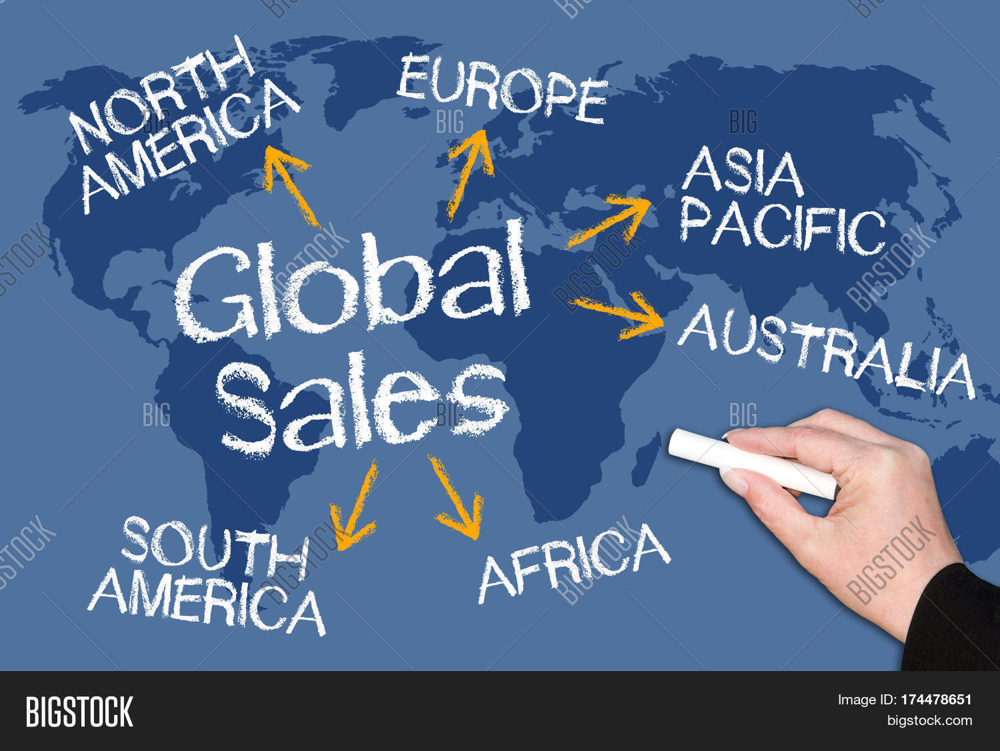
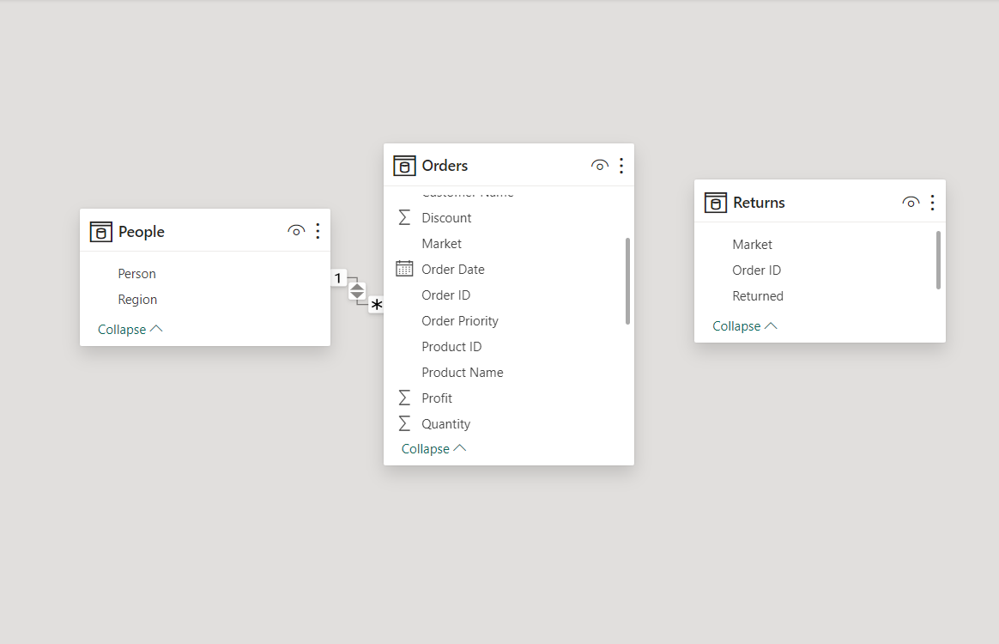
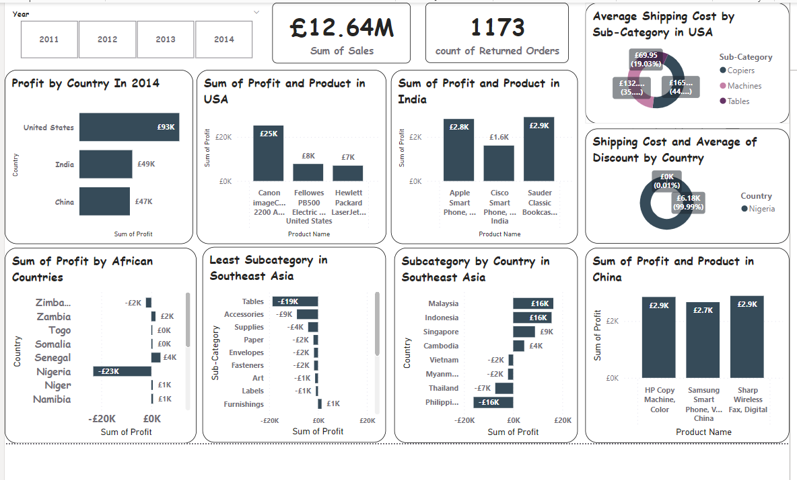
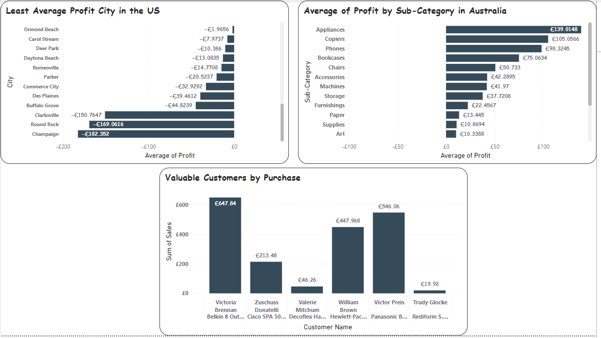

# Global-Superstore-Analysis

## Introduction
This Power BI Project is aimed at analysing and drawing out meaningful insights from the **Global Superstore** Data set which contains information about the superstore clientele, hailing from 147 countries, can browse through an endless offering  with more than 10,000 products, the goal is to draw out meaningful insight which would aid management in making informed decisions to improve performance and profitability, presented in a concise Report/Dashboard.

**_Disclaimer_**; _All data sets report Do not represent any company, intuition, or country but just a practice data set to demonstrate the capabilities of Power BI._

## Problem Statement
Question 1.
a) What are the three countries that generated the highest total profit for Global Superstore in 2014?
b) For each of these three countries, find the three products with the highest total profit. Specifically,
what are the products’ names and the total profit for each product?

Question 2.
a)	Identify the 3 subcategories with the highest average shipping cost in the United States
Question
3.
a) Assess Nigeria’s profitability (i.e., total profit) for 2014. How does it compare to other African
countries?
b) What factors might be responsible for Nigeria’s poor performance? You might want to investigate
shipping costs and the average discount as potential root causes.

Question 4.
a) Identify the product subcategory that is the least profitable in Southeast Asia.
Note: For this question, assume that Southeast Asia comprises Cambodia, Indonesia, Malaysia, Myanmar
(Burma), the Philippines, Singapore, Thailand, and Vietnam.
b) Is there a specific country i n Southeast Asia where Global Superstore should stop offering the
subcategory identified in 4a?

Question 5.
a) Which city is the least profitable (in terms of average profit) in the United States? For this analysis,
discard the cities with less than 10 Orders. b) Why is this city’s average profit so low?

Question 6.
a)	Which product subcategory has the highest average profit in Australia?

Question 7.
a)Who are the most valuable customers and what do they purchase?

## Data Sourcing
the data set is gotten from Digitaley_drive, retrieved as an excel file and extracted into Power BI for cleanin,analysis and visualization. it comprises of 3 tables table orders,returns and people.

## Skills/Concept Demostrated
The following measures where incoperated ; DAX new measurescount;count, sum, filters and modelling

## Data Modelling
Power BI automatically created a one to many relationship between both tables,The model is a star schema between table people and table orders.

## Visualization
This comprises of two dashboards

    | 

## Analysis
1A.The three countries that generated the highest total profit for global superstore in the year 2014 are The United States  with a total profit of £93K, India with a total profit of £49K and China with a total profit of £47K.

1B.products in The united states with highest total profit are; Canon Image class 2200 advanced copier with a profit of £25K, Fellowes PB500 Electric punch plastic comb binding machine with manual bind  with a profit of £8k and Hawlett Pacard laser jet 3310 copier with a profit of £7k.

  Products in India with the highest total profit are; Apple smart phone with caller ID worth £2.9k, Cisqo smart phone with caller ID worth £1.6K and Sauder classic bookcase, traditional worth £2.9k.
  
   Products in china with the highest total profit are; HP copy machine,color with a profit of £2.9K, Samsung smartphone VoIP with a total profit of £2.7K and Sharp Wireless Fax, Digital worth £2.9K.

2. The 3 subcategories with the highest average shipping cost in the United States are; Copiers worth £165 (44.98%), Machines worth £132(35.99%) and Tables worth £69.95(19.03%).

3.A
Profits generated from all African countries are quite low with the highest been £3K But in aspect of nigeria’s profitability the reverse is the case has the country has no profit but are in the debt as the number shows a negative -23k despite having sales of 15.34k sales

3.B
   Factors responsible like the shipping cost and discount provided for these products shows that Nigeria had 0.01% discount from their orders and the shipping cost is £6.18k(99.99%) which is not good for the business.

4.A 
the least profitable product category is the Tables category with a debt of -19k has they have a no profit, this is common in areas like Indonesia ,Thailand, philipines , Vietnam and Myanmar.

4.B Based on the information gotten from the Least subcategory (Tables) Thailand, Philippines most especially Indonesia (-11K) had the most insignificant debt. Offering more products in these countries is not advisable.

5.A/B
The city of champaign is the least profitable in the United States, the average profit is £-182 . the most purchase product is the Eldon L workstation diamond Chairmat which falls under the Storage subcategory which is not among the highest subcategories and has little or no discounts.

6.the product category with the highest average profit subcategory in Australia is the Appliances subcategory with an average profit of £139K.

7.The most valuable customers based on the products they bought are:

  1.Victoria Brennan, product name; Belkin and outlet surge master.
  
  2.Zuschuss Donatell, product name; Cisco SPA 501G.
  
  3.Valerie Mitchum, product name; decoflex Hanging personal folder file. 
  
  4.William Brown, product name; Hewlette Packard desk jet.
   
  5.victor preis, product name; Panasonic  business telephones.

  6.Trudy Glocke, product name; Rediform sos phone message books.

  ## Conclusion and Recommendation
  1. champaign is the least profitable in the US therefore product offerings in this area must be removed.
  2. Regions where thre are returned Orders should be regulated and monitored.
  3. there should be provision of more discounts and less shipping cost to African countries to improve sales.
  4. product offering needs to be stopped in the least subcategories in south east asia. 

## Limitations
I tried creating a relationship with the returns table to the orders table but it had no relationship.

#THANK YOU...

